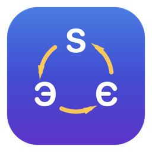

# Switcher3way

<p align="center">
  
</p>

<p align="center">
  <b>macOS menu-bar app that detects the language you're typing and fixes the keyboard layout — across three languages: English, Ukrainian, Russian.</b>
</p>

<p align="center">
  <a href="https://github.com/WhisKeySwitch/switcher3way-releases/releases/latest"></a>
  
  
  <a href="LICENSE"></a>
</p>

<p align="center">
  <a href="https://github.com/WhisKeySwitch/switcher3way-releases/releases/latest"><b>⬇&nbsp; Download the latest DMG</b></a>
</p>

Typed `ghbdtn` when you meant `привет` — or `ghbdsn` when you meant `привіт`? Switcher3way notices words typed in the wrong layout and converts them, either **automatically as you type** or when you tap the **trigger key**. Unlike two-layout switchers, detection is **N-way**: the typed keystrokes are rendered through *every* installed layout, each candidate is validated against its own language's dictionary, and the app switches only when there's a single unambiguous winner. Precision-first: words valid in more than one language (e.g. `там` in both Ukrainian and Russian) are left alone.

## Features

- **3-way (N-way) auto-detection** over all installed keyboard layouts — nothing to configure
- **Manual trigger** — tap a configurable key (single or double tap) to convert the last word or selection; tap again to undo
- **Auto-fix as you type** (off by default) — validates finished words against the macOS system dictionaries
- **Exception lists** — apps where auto-fix stays off (password managers always off), never-convert and always-convert words; a wrong fix undone by the trigger offers to remember the word
- **Per-app layout memory**, layout flag at the text cursor, layout sound (all optional)
- Menu-bar status header with the current layout, quick toggles, and pause (30 min / 1 h / until restart)
- Interface in 16 languages

## Install

**Download the DMG** from the [latest release](https://github.com/WhisKeySwitch/switcher3way-releases/releases/latest), open it, and drag **Switcher3way.app** into **Applications**.

The app is unnotarized (no Apple Developer account), so the **first** launch is blocked by Gatekeeper if you double-click it — instead **right-click the app → Open**, then confirm. macOS remembers the choice, so later launches are normal.

On first launch the onboarding checklist asks for two macOS permissions — **Accessibility** (read and retype the mistyped word) and **Input Monitoring** (see keystrokes). Grants are detected live; the app restarts itself after Input Monitoring is granted.

### Build it yourself

Requires the Swift toolchain (Xcode or the Command Line Tools):

```bash
git clone https://github.com/WhisKeySwitch/Switcher3way.git
cd Switcher3way
bash build_app.sh                    # SwiftPM release (universal), signed
cp -R Switcher3way.app /Applications/
open /Applications/Switcher3way.app
```

By default `build_app.sh` signs **ad-hoc**, which means macOS resets the Accessibility/Input Monitoring grants on every rebuild. To make the permissions survive rebuilds, set up the stable self-signed certificate once as described in `signing/README.md` — the script then signs with that identity automatically.

## Documentation

- **[User Guide](docs/user-guide.md)** ([Українська](docs/user-guide.uk.md) · [Русский](docs/user-guide.ru.md)) — everything a user needs: setup, trigger, auto-fix, exceptions, settings, troubleshooting
- `CLAUDE.md` — developer handover: architecture map, build loop, conventions
- `NOTES-3WAY.md` — fork rationale, detection policy, DMG packaging
- `openspec/` — capability specs

## Credits & license

Forked from [rashn/RuSwitcher](https://github.com/rashn/RuSwitcher) (MIT) — a two-layout RU/EN switcher — and generalized to N-way with a reworked UI. MIT License; see [LICENSE](LICENSE).
