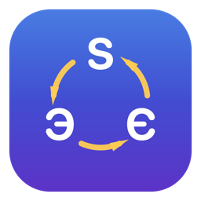

# Switcher3way

<p align="center">
  
</p>

<p align="center">
  <b>macOS and Windows app that detects the language you're typing and fixes the keyboard layout — across three languages: English, Ukrainian, Russian.</b>
</p>

<p align="center">
  <a href="https://github.com/WhisKeySwitch/switcher3way-releases/releases/latest"></a>
  
  <a href="https://apps.microsoft.com/detail/9MXFXL7GG3C5"></a>
  <a href="LICENSE"></a>
</p>

<p align="center">
  <a href="https://github.com/WhisKeySwitch/switcher3way-releases/releases/latest"><b>⬇&nbsp; Download for macOS</b></a>
  &nbsp;·&nbsp;
  <a href="https://apps.microsoft.com/detail/9MXFXL7GG3C5"><b>⬇&nbsp; Get it for Windows</b></a>
</p>

Typed `ghbdtn` when you meant `привет` — or `ghbdsn` when you meant `привіт`? Switcher3way notices words typed in the wrong layout and converts them, either **automatically as you type** or when you tap the **trigger key**. Unlike two-layout switchers, detection is **N-way**: the typed keystrokes are rendered through *every* installed layout, each candidate is validated against its own language's dictionary, and the app switches only when there's a single unambiguous winner. Precision-first: words valid in more than one language (e.g. `там` in both Ukrainian and Russian) are left alone.

## Features

- **3-way (N-way) auto-detection** over all installed keyboard layouts — nothing to configure
- **Manual trigger** — tap a configurable key (single or double tap) to convert the last word or selection; tap again to undo
- **Auto-fix as you type** (off by default) — validates finished words against the macOS system dictionaries
- **Exception lists** — apps where auto-fix stays off (password managers always off), never-convert and always-convert words; a wrong fix undone by the trigger offers to remember the word
- **Per-app layout memory**, layout flag at the text cursor, layout sound (all optional)
- Menu-bar / tray status header with the current layout, quick toggles, and pause (30 min / 1 h / until restart)
- **The trigger always answers** — when it has nothing to convert (only one keyboard layout installed, nothing typed or selected, text already correct) it says so at the cursor instead of doing nothing
- Interface in 16 languages
- **Private and offline** — no accounts, no telemetry, no network calls; password fields are excluded

## Install — macOS

**Download the DMG** from the [latest release](https://github.com/WhisKeySwitch/switcher3way-releases/releases/latest), open it, and drag **Switcher3way.app** into **Applications**.

The app is unnotarized (no Apple Developer account), so the **first** launch is blocked by Gatekeeper if you double-click it — instead **right-click the app → Open**, then confirm. macOS remembers the choice, so later launches are normal.

On first launch the onboarding checklist asks for two macOS permissions — **Accessibility** (read and retype the mistyped word) and **Input Monitoring** (see keystrokes). Grants are detected live; the app restarts itself after Input Monitoring is granted.

## Install — Windows

**[Get it from the Microsoft Store](https://apps.microsoft.com/detail/9MXFXL7GG3C5)** — signed by Microsoft, so no SmartScreen warning, nothing to install first, and it updates itself. This is the recommended way and the version that gets fixes first.

There is also a [direct-download MSI](https://github.com/WhisKeySwitch/switcher3way-releases/releases/tag/windows-v0.2.9) for anyone who can't use the Store. It needs the [Windows App Runtime 1.6](https://aka.ms/windowsappsdk/1.6/latest/windowsappruntimeinstall-x64.exe) installed once and isn't code-signed (SmartScreen will warn — **More info → Run anyway**), but it updates itself and tracks the same version as the Store build.

Windows needs no permission dialog. Switcher3way runs in the notification area and has no main window; Windows 11 hides new tray icons, so expand the notification area with the **^** chevron if you don't see the flag. Add a second keyboard layout first (**Settings → Time & language → Language & region**) — with only one layout there is nothing to convert between, and the app will tell you so.

## Build it yourself

**macOS** — requires the Swift toolchain (Xcode or the Command Line Tools):

```bash
git clone https://github.com/WhisKeySwitch/Switcher3way.git
cd Switcher3way
bash build_app.sh                    # SwiftPM release (universal), signed
cp -R Switcher3way.app /Applications/
open /Applications/Switcher3way.app
```

By default `build_app.sh` signs **ad-hoc**, which means macOS resets the Accessibility/Input Monitoring grants on every rebuild. To make the permissions survive rebuilds, set up the stable self-signed certificate once as described in `signing/README.md` — the script then signs with that identity automatically.

**Windows** — requires the .NET 8 SDK and Visual Studio's MSIX/PRI build tooling (the UWP workload):

```powershell
git clone https://github.com/WhisKeySwitch/Switcher3way.git
cd Switcher3way
pwsh windows/build-msi.ps1           # direct-download installer
pwsh windows/build-msix.ps1          # Microsoft Store package
dotnet test windows/tests/Switcher3way.Core.Tests   # the decision core's suite
```

The Windows app is C# / WinUI 3 under [`windows/`](windows/); the layout-detection core is shared logic with its own test suite. See [`windows/RELEASING.md`](windows/RELEASING.md) for the release and submission process.

## Documentation

- **[User Guide](docs/user-guide.md)** ([Українська](docs/user-guide.uk.md) · [Русский](docs/user-guide.ru.md)) — everything a user needs: setup, trigger, auto-fix, exceptions, settings, troubleshooting
- `CLAUDE.md` — developer handover: architecture map, build loop, conventions
- `NOTES-3WAY.md` — fork rationale, detection policy, DMG packaging
- `windows/RELEASING.md` — Windows build, signing, Store submission and its traps
- `openspec/` — capability specs, including `windows-platform-support`

## Credits & license

Forked from [rashn/RuSwitcher](https://github.com/rashn/RuSwitcher) (MIT) — a two-layout RU/EN switcher — and generalized to N-way with a reworked UI. MIT License; see [LICENSE](LICENSE).
